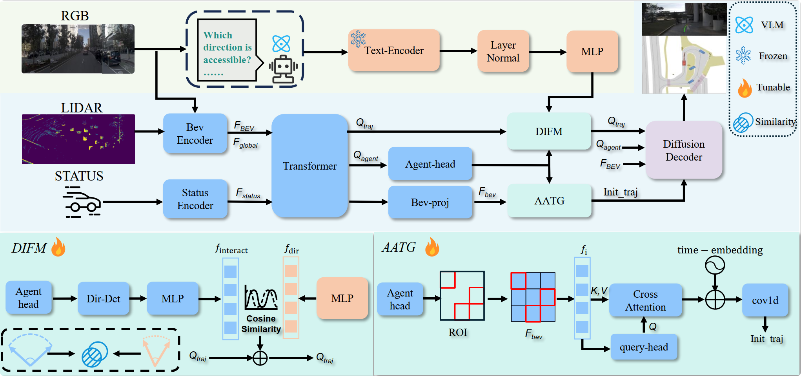

# Semantic-AD
This is the official implementation of Interpretable and Generalizable Diffusion Planning via Vision-Language Guidance and Agent-Aware Trajectory Initialization.The code will be released upon acceptance.

# 📣 Overview
We propose a novel vision-language guided diffusion planner for autonomous driving, integrating:
- High-level semantic driving instructions extracted by a Vision-Language Model (Qwen2.5-VL)
- Agent-aware spatial distribution cues projected onto the BEV map
- Dynamic trajectory initialization for more structured and adaptive planning
- Conditional diffusion decoding for robust, interpretable, and intent-aligned trajectory generation
Our framework significantly improves intent alignment, safety, generalizability, and interpretability across diverse driving scenarios.
# 🏛️ Framework Overview

  

> Figure: Overall architecture of our language-guided diffusion planner.
> The model fuses RGB, LiDAR, vehicle state, VLM semantic cues, and agent-aware priors to guide diffusion-based trajectory generation.

# 🔒 Code Availability
The implementation is currently not public due to the review process.
It will be released once the paper is accepted.
